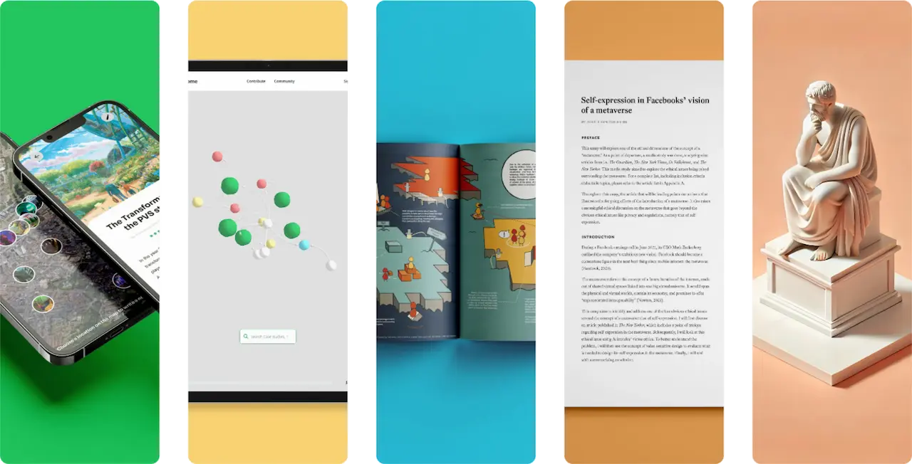

  

 

 

# 👋 Hi, I'm Jorrit
A designer-developer from Nijmegen, the Netherlands, who works on projects with a positive social impact.

## 💬 Ask me about
- Frontend development (React.js, Tailwind, Flutter)
- Backend development (TypeScript, PHP, Dart, Python)
- UX/UI & Design systems (Figma, Atlassian, Material Design)
- Linux & Declarative system management (NixOS)
- DevOps & CI/CD (Docker, Nix Flakes)

<!--
## 📅 Hobbies
- 

## 💻 Current projects
- 

## 📚 Learning
- 3D modeling
- Ham radio
- PCB design
-->

 

|  |  |
| ------------- | ------------- |
